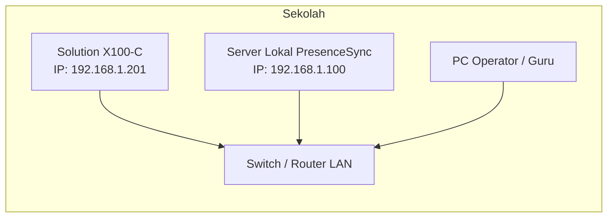
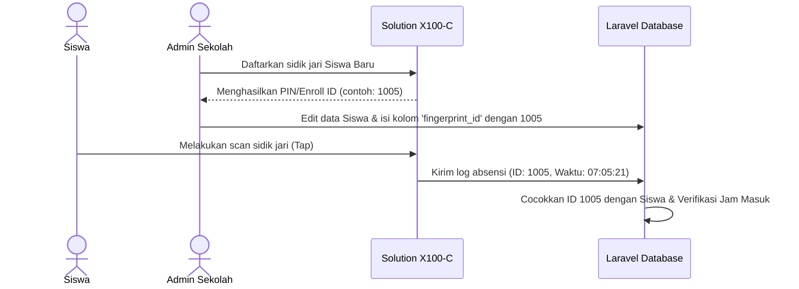

# Panduan Alur Integrasi Perangkat Solution X100-C (Server Lokal/LAN)

Dokumen ini menjelaskan alur teknis integrasi mesin sidik jari **Solution X100-C** ke server lokal sekolah yang menjalankan sistem **PresenceSync**.

---

## 1. Topologi Jaringan (LAN)



*   **Mesin Fingerprint** dan **Server PresenceSync** harus berada dalam satu segmen jaringan LAN yang sama agar dapat saling berkomunikasi.
*   Disarankan menggunakan alokasi IP Statis (*Static IP*) baik untuk mesin sidik jari maupun untuk server.

---

## 2. Alur Operasional (Pendaftaran & Sinkronisasi Siswa)

Sebelum sistem dapat mencatat kehadiran secara otomatis, data pengenal (ID) pada mesin dan sistem web PresenceSync harus disinkronkan.



### Langkah Operasional Detail:
1.  **Registrasi Fisik:** Admin mendaftarkan sidik jari siswa langsung pada mesin Solution X100-C. Mesin akan menerbitkan ID Pengguna (User ID / PIN / Enrollment ID), misalnya: `1005`.
2.  **Pemetaan Sistem:** Admin membuka aplikasi **PresenceSync** di browser, cari nama siswa tersebut, lalu masukkan angka `1005` pada kolom **ID Fingerprint** (`fingerprint_id`).

---

## 3. Pilihan Metode Integrasi Data

Ada dua metode utama untuk mengirimkan data log dari mesin ke Server Lokal PresenceSync:

### Pilihan A: Real-Time HTTP Push (ADMS Protocol) — Sangat Direkomendasikan

Dalam skenario ini, mesin bertindak sebagai *client* yang secara aktif mengirim data langsung ke server Laravel sesaat setelah sidik jari di-scan.

```
+-------------------+                   +----------------------------+
|  Solution X100-C  | -- HTTP POST ---> | Server Laravel PresenceSync|
|  (ADMS Enabled)   |                   | (http://192.168.1.100/api) |
+-------------------+                   +----------------------------+
```

#### **Konfigurasi Mesin:**
1. Masuk ke **Menu** -> **Komunikasi** -> **ADMS** (atau **Cloud Server Settings**).
2. Konfigurasikan parameter berikut:
   *   **Server Address:** `192.168.1.100` (IP Server Lokal PresenceSync)
   *   **Server Port:** `80` (atau port web server Laravel Anda, misal: `8000`)
   *   **Enable/Aktifkan ADMS:** `Ya` / `True`

#### **Cara Kerja Sistem Laravel:**
*   Laravel menyediakan endpoint API penerima (misalnya: `/api/attendance/push`).
*   Setiap kali siswa tap jari, mesin mengirimkan request JSON/XML berisi data absensi.
*   Laravel mengidentifikasi siswa berdasarkan `fingerprint_id` dan mencatat waktu masuk/pulang.

---

### Pilihan B: Pull SDK (Terjadwal / Polling)

Metode ini menggunakan program perantara (script helper) di server lokal untuk menarik data secara berkala dari mesin menggunakan protokol komunikasi ZKTeco SDK (port UDP/TCP 4370).

```
+----------------------------+                   +-------------------+
| Server Laravel PresenceSync|                   |  Solution X100-C  |
| (Menjalankan Script Pull)  | <--- UDP 4370 --- |   (IP Static)     |
+----------------------------+                   +-------------------+
```

#### **Cara Kerja:**
1.  Mesin Solution X100-C dibiarkan standby di IP `192.168.1.201` port `4370`.
2.  Server lokal menjalankan script penarik data (misalnya ditulis menggunakan PHP CLI dengan library `php-zkteco` atau Python `pyzk`).
3.  Script ini dijadwalkan berjalan otomatis menggunakan **Cron Job** (Linux) atau **Windows Task Scheduler** setiap 5 atau 10 menit sekali.
4.  Alur Script:
    *   Koneksi ke IP `192.168.1.201:4370`.
    *   Tarik log absensi terbaru.
    *   Simpan ke tabel database Laravel.
    *   Bersihkan log mesin secara berkala jika memori mendekati batas maksimal (200.000 log).
