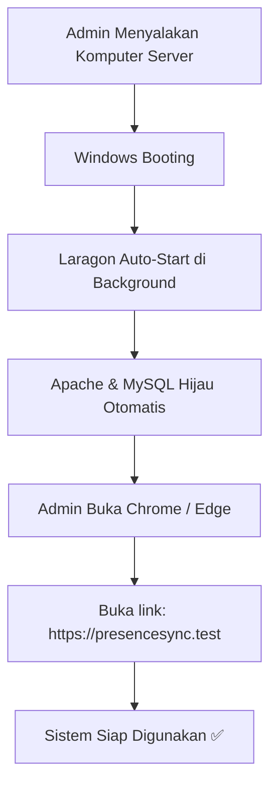

# Panduan Setup Virtual Host (VHost) PresenceSync di Server Sekolah

Dokumen ini berisi panduan langkah demi langkah untuk mengonfigurasi **PresenceSync** di komputer server sekolah menggunakan **Virtual Host (VHost) Laragon** dan **Local SSL (HTTPS)**.

Setelah setup ini selesai, admin sekolah **tidak perlu lagi membuka terminal / Command Prompt** (`npm run dev` atau `php artisan serve`). Sistem akan berjalan otomatis saat komputer dinyalakan dan bisa diakses langsung via link:
👉 **`https://presencesync.test`**

---

## Daftar Isi
1. [Spesifikasi & Persyaratan Awal](#1-spesifikasi--persyaratan-awal)
2. [Langkah 1: Setup Laragon di Server](#langkah-1-setup-laragon-di-server)
3. [Langkah 2: Menaruh Project ke Folder www](#langkah-2-menaruh-project-ke-folder-www)
4. [Langkah 3: Konfigurasi PHP Version & Ekstensi](#langkah-3-konfigurasi-php-version--ekstensi)
5. [Langkah 4: Mengaktifkan HTTPS (Local SSL)](#langkah-4-mengaktifkan-https-local-ssl)
6. [Langkah 5: Konfigurasi Database & APP_KEY](#langkah-5-konfigurasi-database--app_key)
7. [Langkah 6: Konfigurasi Auto-Start Windows](#langkah-6-konfigurasi-auto-start-windows)
8. [Langkah 7: Akses dari Komputer Lain (Jaringan LAN / WiFi Sekolah)](#langkah-7-akses-dari-komputer-lain-jaringan-lan--wifi-sekolah)
9. [Alur Operasional Harian Admin](#alur-operasional-harian-admin)
10. [Troubleshooting](#troubleshooting)

---

## 1. Spesifikasi & Persyaratan Awal
- **Sistem Operasi**: Windows 10 / 11 / Windows Server (64-bit).
- **Web Server Stack**: [Laragon Full](https://laragon.org/download/) (PHP 8.4+, Apache 2.4, MySQL 8.0+).
- **Akses**: Administrator Windows.

---

## 2. Langkah 1: Setup Laragon di Server
1. Download dan install **Laragon Full** dari situs resminya: https://laragon.org/download/
2. Install di direktori standar: `C:\laragon`
3. Buka aplikasi Laragon, klik **Start All** untuk memastikan Apache dan MySQL berjalan normal.

---

## 3. Langkah 2: Menaruh Project ke Folder www
Pastikan folder project diletakkan di direktori:
```
C:\laragon\www\presencesync
```
Struktur folder yang benar:
```
C:\laragon\www\presencesync\
  ├── app/
  ├── bootstrap/
  ├── config/
  ├── public/          <-- Ini document root Laravel
  │    ├── index.php
  │    ├── demo1/
  │    └── ...
  ├── storage/
  ├── .env
  └── ...
```

---

## 4. Langkah 3: Konfigurasi PHP Version & Ekstensi
PresenceSync membutuhkan **PHP versi 8.4 atau lebih tinggi**.

1. Di jendela **Laragon**, klik tombol **Menu** (atau klik kanan di mana saja).
2. Arahkan ke **PHP** -> **Version** -> Pilih **`php-8.5.x`** atau **`php-8.4.x`**.
3. Pastikan ekstensi berikut aktif di **Menu -> PHP -> Extensions**:
   - `pdo_mysql`
   - `mbstring`
   - `openssl`
   - `curl`
   - `gd`
   - `fileinfo`
   - `zip`

---

## 5. Langkah 4: Mengaktifkan HTTPS (Local SSL) & VHost

### A. Mengaktifkan Fitur SSL di Laragon:
1. Klik **Menu** -> **Apache** -> **SSL** -> Centang **`Enabled`** (akan muncul tanda centang ✔️).
2. Klik **Menu** -> **Apache** -> **SSL** -> Klik **`Add laragon.crt to Trust Store`** (pilih Yes jika muncul konfirmasi Windows).
3. Klik tombol **`Reload`** di Laragon.
4. Perhatikan pada tulisan Apache, port akan berubah menjadi **`80/443`** dengan ikon **gembok hijau 🟢**.

### B. Otomatisasi Virtual Host (Laragon Magic DNS):
Laragon otomatis membuat file virtual host di:
`C:\laragon\etc\apache2\sites-enabled\auto.presencesync.test.conf`

Dan otomatis mendaftarkan baris berikut di file `C:\Windows\System32\drivers\etc\hosts`:
```hosts
127.0.0.1      presencesync.test    #laragon magic!
```

---

## 6. Langkah 5: Konfigurasi Database & APP_KEY

1. Buka file `.env` di dalam folder `C:\laragon\www\presencesync\.env`
2. Pastikan konfigurasi URL dan Database sudah sesuai:
   ```env
   APP_NAME=PresenceSync
   APP_ENV=production
   APP_DEBUG=false
   APP_URL=https://presencesync.test

   DB_CONNECTION=mysql
   DB_HOST=127.0.0.1
   DB_PORT=3306
   DB_DATABASE=presencesync
   DB_USERNAME=root
   DB_PASSWORD=
   ```
3. Buka **Terminal Laragon** (klik tombol **Terminal** di aplikasi Laragon) dan jalankan perintah:
   ```bash
   # Buat database jika belum ada
   mysql -u root -e "CREATE DATABASE IF NOT EXISTS presencesync CHARACTER SET utf8mb4 COLLATE utf8mb4_unicode_ci;"

   # Generate App Key
   php artisan key:generate --force

   # Migrasi Database & Seeder
   php artisan migrate --force
   php artisan db:seed --force

   # Optimasi Cache
   php artisan optimize
   ```

---

## 7. Langkah 6: Konfigurasi Auto-Start Windows (Paling Penting untuk Admin)

Agar admin **tidak perlu menyalakan apapun secara manual** saat komputer server hidup:

1. Di jendela **Laragon**, klik tombol **Gerigi (Preferences)** di pojok kanan atas (atau **Menu -> Preferences**).
2. Pada tab **General**, centang dua opsi berikut:
   - ✅ **`Run Laragon when Windows starts`**
   - ✅ **`Start All automatically`**
3. Tutup menu Preferences.

---

## 8. Langkah 7: Akses dari Komputer Lain (Jaringan LAN / WiFi Sekolah)

Jika admin atau guru ingin mengakses sistem dari laptop/komputer lain di jaringan sekolah:

### A. Cari Tahu IP Server Sekolah:
Buka CMD di server sekolah, ketik:
```cmd
ipconfig
```
Lihat bagian **IPv4 Address** (misalnya: `192.168.1.100` atau `10.x.x.x`).

### B. Akses dari Komputer Klien / Guru:
1. Buka browser di komputer guru/klien.
2. Ketik:
   ```
   http://192.168.1.100/presencesync/public
   ```
   *(Ganti `192.168.1.100` dengan IP aktual server sekolah).*

### C. (Opsional) Menggunakan Domain `presencesync.test` di Komputer Klien:
Agar komputer guru juga bisa ketik `https://presencesync.test`, tambahkan baris ini di file `C:\Windows\System32\drivers\etc\hosts` komputer klien:
```hosts
192.168.1.100    presencesync.test
```

---

## Alur Operasional Harian Admin



### Yang Harus Dilakukan Admin Setiap Hari:
1. **Nyalakan Komputer Server**.
2. **Buka Browser**, ketik:
   ```
   https://presencesync.test
   ```
   *(Atau double-klik shortcut **PresenceSync** di Desktop).*
3. Selesai! Tidak ada command terminal yang perlu dijalankan.

---

## Troubleshooting

### 1. Muncul "Your connection is not private" di Browser
- **Penyebab**: Sertifikat SSL bersifat lokal (Self-Signed).
- **Solusi**: Klik **Advanced (Lanjutan)** -> Klik **Proceed to presencesync.test (unsafe)**. Hal ini hanya muncul satu kali di browser baru.

### 2. Error 500 "Internal Server Error"
- **Penyebab**: `APP_KEY` belum terbuat atau folder cache terkunci.
- **Solusi**: Buka Terminal Laragon, jalankan:
  ```bash
  php artisan key:generate --force
  php artisan optimize:clear
  ```

### 3. Website Tidak Bisa Dibuka (ERR_CONNECTION_REFUSED / ERR_NAME_NOT_RESOLVED)
- Pastikan aplikasi Laragon menyala dan status Apache + MySQL berwarna **Hijau**.
- Jika merah/berhenti, klik tombol **Start All** di Laragon.

---

*Dokumen ini dibuat untuk tim IT / Teknisi Sekolah PresenceSync.*
